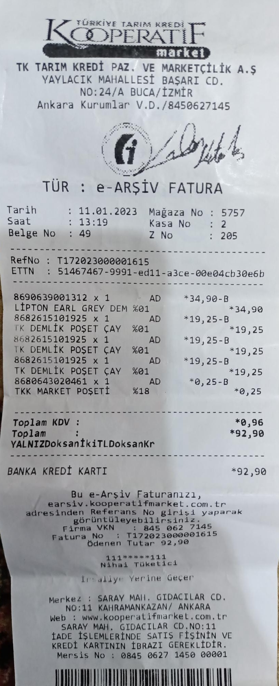

# Readai

Readai is an AI-powered document & invoice extraction pipeline built with
FastAPI, Celery, Redis, OCR and Large Language Models (LLMs).

The goal of this project is not only to extract text from documents,
but to **understand and normalize noisy, real-world documents**
such as scanned invoices, receipts and mixed-quality PDFs.

---

## Current Status

✅ Docker infrastructure (API + Worker + Redis)  
✅ FastAPI service with health check  
✅ Asynchronous job processing with Celery  
✅ File upload & job creation API  
✅ Raw text extraction from:
- PDF (text-based)
- Images / scanned documents (OCR)
- Plain text files

🚧 LLM-based normalization and structured extraction (in progress)

---

## Quick Start

```bash
cp .env.example .env
docker compose -f docker/compose.yml up --build
```

## API:

- http://localhost:8000/docs

- http://localhost:8000/health

### Project Architecture (High Level)
```
Client
  |
  v
FastAPI (API Layer)
  |
  v
Redis (Queue)
  |
  v
Celery Worker
  |
  v
Document Processing Pipeline
```

The API layer is responsible for request handling and job creation,
while all heavy processing (OCR, LLM inference, validation) is executed
asynchronously by Celery workers.

## Raw Text Extraction Philosophy

Readai intentionally separates raw text extraction from semantic understanding.

At this stage, the system focuses on extracting as much information as possible
from documents, even if the result contains noise or inconsistencies.

Normalized outputs produced by LLMs are stored in the same artifact
as the raw OCR result, keyed by model name.
This allows multiple models to be evaluated without duplicating files
or re-running expensive inference steps.

### Why this matters
Real-world documents are messy:

- Logos
- Background textures
- Low-quality scans
- Skewed or cropped images
- Mixed fonts and encodings

OCR engines may extract:

- Incorrect characters
- Broken words
- Duplicated or missing lines

However, aggressive pre-processing (e.g. cropping, filtering) introduces trade-offs.

### Example Observation
During testing with a retail invoice image:

- Full image OCR
    - More noise
    - More contextual information

- Manually cropped image OCR
    - Cleaner text
    - Potential loss of contextual or structural data

This demonstrates an important principle:

Pre-processing can increase data quality,
but it can also cause irreversible information loss.

Because of this, Readai treats raw extraction as a loss-tolerant stage
and postpones interpretation and correction to later steps.

## Example Artifacts (Real OCR Results)

### Input Image — Full Receipt (No Cropping)


📄 **Raw OCR Output:**  
[View raw OCR JSON](static/json/image_raw.json)

**Observations:**
- Contains background texture and surrounding noise
- OCR output preserves more context
- Higher noise level

---

### Input Image — Manually Cropped Receipt



📄 **Raw OCR Output:**  
[View raw OCR JSON](static/json/cropped_image_raw.json)

**Observations:**
- Focused on text region
- Cleaner OCR output
- Risk of losing peripheral or contextual information
