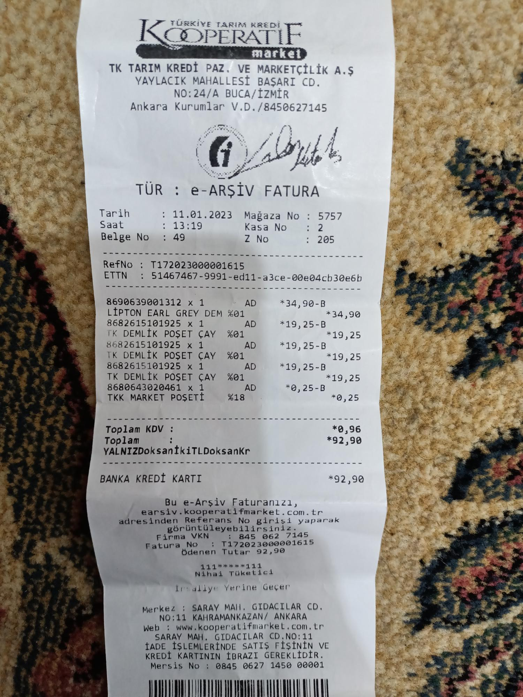

# Readai

Readai is an AI-powered document & invoice extraction pipeline built with
FastAPI, Celery, Redis, OCR and Large Language Models (LLMs).

The goal of this project is not only to extract text from documents,
but to **understand and normalize noisy, real-world documents**
such as scanned invoices, receipts and mixed-quality PDFs.

---

## Current Status

✅ Docker infrastructure (API + Worker + Redis)  
✅ FastAPI service with health check  
✅ Asynchronous job processing with Celery  
✅ File upload & job creation API  
✅ Raw text extraction from:
- PDF (text-based)
- Images / scanned documents (OCR)
- Plain text files

Structured data extraction (schema-based) — in progress

---

## Quick Start

```bash
cp .env.example .env
docker compose -f docker/compose.yml up --build
```

## API:

- http://localhost:8000/docs

- http://localhost:8000/health

## Project Architecture (High Level)
```
Client
  |
  v
FastAPI (API Layer)
  |
  v
Redis (Queue)
  |
  v
Celery Worker
  |
  v
Document Processing Pipeline
```

The API layer is responsible for request handling and job creation,
while all heavy processing (OCR, LLM inference, validation) is executed
asynchronously by Celery workers.

## Raw Text Extraction Philosophy

Readai intentionally separates raw text extraction from semantic understanding.

At this stage, the system focuses on extracting as much information as possible
from documents, even if the result contains noise or inconsistencies.

Normalized outputs produced by LLMs are stored in the same artifact
as the raw OCR result, keyed by model name.
This allows multiple models to be evaluated without duplicating files
or re-running expensive inference steps.

## Why this matters
Real-world documents are messy:

- Logos
- Background textures
- Low-quality scans
- Skewed or cropped images
- Mixed fonts and encodings

OCR engines may extract:

- Incorrect characters
- Broken words
- Duplicated or missing lines

However, aggressive pre-processing (e.g. cropping, filtering) introduces trade-offs.

## Example Observation
During testing with a retail invoice image:

- Full image OCR
    - More noise
    - More contextual information

- Manually cropped image OCR
    - Cleaner text
    - Potential loss of contextual or structural data

This demonstrates an important principle:

Pre-processing can increase data quality,
but it can also cause irreversible information loss.

Because of this, Readai treats raw extraction as a loss-tolerant stage
and postpones interpretation and correction to later steps.

## Example Artifacts (Real OCR Results)

### Input Image — Full Receipt (No Cropping)



📄 **Raw OCR Output:**  
[View raw OCR JSON](static/json/82f2d888-e659-4560-aa85-d38e9a26d2e7_fatura.json)

**Observations:**
- Contains background texture and surrounding noise
- OCR output preserves more context
- Higher noise level

---

### Input Image — Manually Cropped Receipt


📄 **Raw OCR Output:**  
[View raw OCR JSON](static/json/3630121b-9945-431c-91e3-fed29e3c25b6.json)

**Observations:**
- Focused on text region
- Cleaner OCR output
- Risk of losing peripheral or contextual information


### PDF Text Extraction (Text-based PDFs)

Readai supports native text extraction from PDF files in addition to OCR-based image processing.

If a PDF contains embedded, selectable text (i.e. it is not a scanned image),
the system extracts text directly without invoking OCR.
This allows faster processing and avoids OCR-related noise when possible.

Example — Text-based PDF

[Input PDF](static/files/4967c662-305e-4f78-b219-c6837f50dc17_ornek_fatura_readai.pdf)

[Extracted JSON Output](static/json/4967c662-305e-4f78-b219-c6837f50dc17.json)

Observations:

- No OCR artifacts

- Preserved original text structure

- Faster processing compared to image OCR

- Ideal for digitally generated invoices and documents

Readai automatically detects whether a PDF is:

- Text-based → direct text extraction

- Image-based → OCR pipeline

This hybrid approach ensures the most accurate and efficient extraction path
is chosen per document.

## LLM Normalization & Post-Fix Layer

After raw text extraction (OCR or PDF text),
Readai applies LLM-based normalization followed by a deterministic post-fix layer.

## Why two layers?

LLMs are powerful but probabilistic.
They may hesitate to correct certain OCR artifacts or,
if unconstrained, may introduce unwanted changes.

To address this, Readai uses a two-stage correction strategy:

## LLM Normalization (Conservative)

The LLM:

- Reviews the extracted text
- Corrects only high-confidence OCR spelling and character errors
- Does not add, remove or reinterpret content
- Returns a cleaned version of the text

If the LLM fails or returns invalid output,
the pipeline safely falls back to the raw extracted text.

## Post-Fix Layer (Deterministic)

After LLM processing, a deterministic post-fix module is applied.

This layer:

- Fixes known, high-confidence OCR artifacts
- Applies only exact, controlled replacements
- Never rewrites sentences or alters meaning
- Works even if the LLM produces no changes

Examples of post-fix corrections:
<table>
<tr>
<th>OCR Output</th><th>Post-Fix Result</th>
</tr>
<tr>
<td>amaçlndnr</td><td>amaçlıdır</td>
</tr>
<tr>
<td>Yalnnz</td><td>Yalnız</td>
</tr>
<tr>
<td>nstanbul</td><td>İstanbul</td>
</tr>
<tr>
<td>Dannnmanlnk</td><td>Danışmanlık</td>
</tr>
<tr>
<td>A.n.</td><td>A.Ş.</td>
</tr>
</table>


This guarantees that:

- Obvious OCR errors are always corrected
- No speculative or semantic changes are introduced
- The system remains predictable and auditable

## Final Output Guarantee

The final normalized text stored in the job artifact:

- Is structurally identical to the original document
- Contains no LLM commentary or explanations
- Preserves all numbers, dates and monetary values
- Applies only safe, explainable corrections

## Artifact Storage Strategy

Each job produces a single JSON artifact containing:

- Input metadata
- Raw extracted text
- LLM-normalized text (keyed by model name)
- Post-fix–corrected final output

This design enables:
- Model comparison
- Reprocessing without re-OCR
- Transparent debugging and evaluation

## Non-goals

Readai does not attempt to:
- Automatically infer business semantics
- Guess missing financial data
- Perform aggressive document rewriting
- Replace human validation in critical workflows


## License

This project is licensed for **non-commercial use only**.
See the [LICENSE](LICENSE) file for details.
